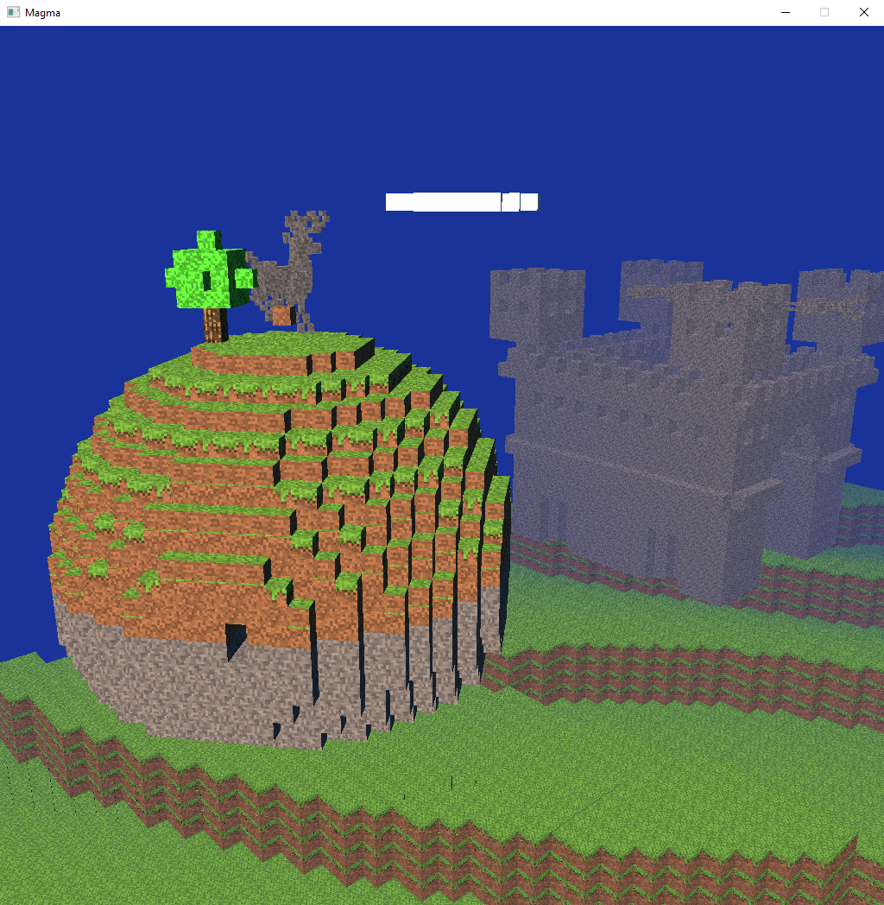

# Magma: A Simple HLSL Playground

## Motivation
I am a guy who used to make a living with programming.  As many programmers I eventually got invited to do full time management at my company.  I started this project to prevent my coding skills from completely atrophying.  I was a graphics programming major back at school and had a few paid gigs doing graphics programming as a student.  That was mostly in the days before real time programmable shading.  Just after the first pixel and vertex shaders were invented I abandoned graphics in favor of other topics.  Fast-forward around twenty years, and GPUs have become nearly arbitrarily programmable.  

One day I thought it would be cool to dive back into doing some graphics coding on modern GPUs.  Most people by now were doing graphics programming -- especially for games using sophisticated engines like Unity or Unreal that took care of and hid a lot of the (for me, often interesting low level) complexity, and replaced that with their own (for me uninteresting higher level) complexity.  One project stood out for me as interesting and different: [Inigo Quilez](https://iquilezles.org/)'s [Shadertoy](https://www.shadertoy.com/) stood out as a web platform where I was able to write and share GPU shader code without any complexity whatsoever, just using a browser.  

I thought (and still think!) that writing shaders in Shadertoy was very, very cool, but I wanted to do a few things beyond what it let me do: 

* I was curious about the so called 'host side' graphics programming that shadertoy was completely hiding from me.  That is essentially the admittedly boring CPU side code that loads resources, compiles shaders, binds and populates buffers, and so on.  I wanted to be able to write that stuff myself too, primarily as a means about learning all aspects of modern graphics programming.

* Modern GPUs support at least three flavors of shaders: Vertex shaders, pixel shaders and compute shaders.  Shadertoy focuses exclusively on pixel shaders, but I wanted to be able to write and explore all three kinds.

* Shadertoy offers you the ability to create buffers of data (like textures) that you can send to your shaders for processing, but it is relatively limited in what you can do in this department, and I wanted to have more flexibility here.

* Finally, I am old school, and I prefer an offline out of browser experience.  Just my IDE, my compiler, my OS and hardware.  This is probably irrational, but I am old and set in my ways.

So with these goals established, I went to work.  I started this project late October 2013 as my personal Mercurial source control tells me.  And I worked on it very sporadically because I am very lazy.  Today in July 2023 as I write this, this Mercurial repo is on revision number 138.  That is something like, what, 13 changes per year, around one change per month?  Anyway, in the meantime the world nearly forgot about Mercurial and all the cool kids are putting their code on GitHub.  I want to be a cool old man, so I thought it is time to put this old thing online.  

## What Are All These Files
### External 
First, as every project these days, we have some annoying external dependencies in the External folder.  The most important is [SDL2](https://github.com/libsdl-org/SDL/tree/SDL2).  Because I use an ancient version of SDL and cannot be bothered to upgrade, I put a binary distro in my External directory just in case they stop hosting old distros and so you don't have to build this relatively large project from source.  I also have the [SDL Image](https://github.com/libsdl-org/SDL_image) library taken care of in the same way for the same reasons.  SDL and SDL Image are used to abstract some basic and uninteresting operating system / GUI capabilities in a portable way.

[NVIDIA PhysX SDK](https://github.com/NVIDIA-Omniverse/PhysX.git): I was planning to add PhysX simulation project from the beginning for some reason but never got around to it.  I am however already using the 3D linear algebra and basic type system from PhysX which makes this dependency necessary.  I am only using the PhysX headers not any of their libraries, so you just need to clone down PhysX into the respective directory, you don't actually need to build it.  I provided a handy batch file for cloning it.  Unfortunately the NVIDIA PhysX team decided to drop support for 32 bit builds which breaks Magma's 32 bit support even if it would not be a problem otherwise.

[Texture Atlas](https://github.com/JohnnyonFlame/texture-atlas.git): A very simple 2D texture atlas library I found that I build to implement a 3D texture atlas.  Also cloned by the batch file.

## Compiler
I provide Visual Studio 2019 and 2022 solution and project files.  After you clone the two above outstanding dependencies you should just be able to open one of the solution files in a free community edition of Visual Studio and hit build.  You want to use Debug or Release for the 64 bit configuration.  As I said above, the 32 bit version won't build any longer because of silly 64-bit only PhysX.  

## Bin
The bin directory has all the stuff that gets executed or simply read at runtime.  We have the following subdirectories here:

* Win64 - This will contain your executables alongside a few necessary extern DLLs after your build succeeds.
* Media - Contains the following resource file types: 

  * HLSL - pixel, vertex and compute shaders in a Microsoft Direct3D compatible dialect.
  * ODS - This is a super simple data representation language I wrote while I was still back at school, kind of like XML or JSON only without the unnecessary complexity.  In this project I not only use it to store 3d meshes but also something it was never meant to do: Create executable scripts.  The language constructs it supports are essentially just constants, variables, function calls (into script or native code), and defining such subroutines.
  * voxvol - These are [Magica Voxel](https://ephtracy.github.io/) files -- essentially voxel volumes.  Voxels are cool so of course I had to include them somehow.

* The file AppMain.Commands.ods - This is essentially the autoexec.bat of the system.  Just edit this text file by uncommenting the line calling the demo you want to run.  There are a few trivially small demos that just display a triangle, texture or 3D box, but there are two bigger demos in subdirectories:
  * Media/Particles - A sample project that implements a perhaps weird or just lazy idea for a 2D grid based fluid solver.  It kind of works.  Not really.
  * VoxelGame - a Minecraft inspired 3D environment built from a mix of procedural and Magica Voxel assets, rendered using Shadertoy style ray marching.  The graphical portion of this project used to be far more elaborate, featuring fewer bugs/artifacts, multipass lighting and even TAA, but at some point I decided that I wanted to focus on other things, so I took all of that stuff out.  I may put it back at some point in the future.

## Src
All the C++ source code, yay!  There are a few subdirectories: 

* Foundation has basic utility code like String class, Array class (yes I hate STL, thank you for asking), etcetera.
* Resource contains host side resource management code for loading and managing things like textures, ODS scripts and other buffers.
* Renderer is host side code for a Direct3D 11 based renderer.  I used to have an OpenGL renderer too, but it was too much of a pain in the ass to maintain two flavors of basically the same host side rendering code, so I ended up abandoning the OpenGL version.  This is the main reason the project is Windows only, sorry Linux zealots.  I think all other host side code is essentially Linux friendly though so all you need to do is rewrite RendererD3D11.* and you're off to the races, at least as far as the host side code is concerned!  The fact that D3D and OpenGL uses different shader dialects is the next obstacle to dreams of portability.
* VoxelGame is a bit of C++ code for a particularly elaborate example project.  The idea is to show that you can of course also write project specific C++ code in addition to GPU HLSL and CPU ODS scripts.
